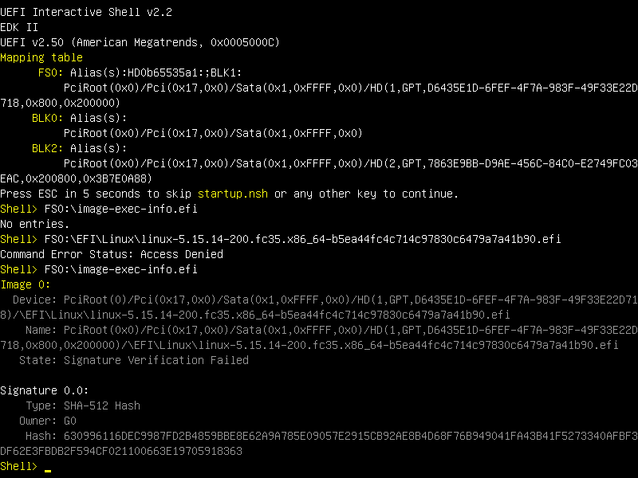

# `image-exec-info`
`image-exec-info` is a UEFI shell tool for displaying the contents of the Secure Boot Image Execution Information table (section 32.5.3.1, [UEFI Specification 2.9](https://uefi.org/sites/default/files/resources/UEFI_Spec_2_9_2021_03_18.pdf)). It is particularly useful in conjunction with Secure Boot Audit Mode found in some UEFI implementations, in which it can be used to run preflight checks.



## Compiling
`image-exec-info` is built with Meson and uses the GNU-EFI library. These can be installed as follows:
```
# Fedora
sudo dnf install @c-development meson gnu-efi-devel
# CentOS/RHEL
sudo yum install --enablerepo=powertools gcc meson gnu-efi-devel
# Debian/Ubuntu
sudo apt install build-essential meson gnu-efi
```
Afterwards, run the usual Meson `setup` and `compile` commands:
```
meson setup build
meson compile -C build
```

## Installation
As this tool is primarily used to test and debug Secure Boot setups, it might make sense to sign or whitelist it before use. Refer to [authvar(1)](https://manpages.ubuntu.com/manpages/impish/man1/authvar.1.html), [efisiglist(1)](https://manpages.ubuntu.com/manpages/impish/man1/efisiglist.1.html), [pesign(1)](https://manpages.ubuntu.com/manpages/impish/man1/pesign.1.html), and your system manual for more information about signing/whitelisting EFI executables.

After configuring the system to allow execution of the program's binary, put it on a filesystem accessible to your UEFI implementation and start it from the [UEFI shell](https://github.com/tianocore/edk2/blob/UDK2018/ShellBinPkg/UefiShell/X64/Shell.efi).

## Bugs
Some UEFI implementations don't record signature verification failures correctly. Some of the known working implementations are American Megatrends UEFI 2.50 and the [Customized Secure Boot branch of EDK-II](https://github.com/tianocore/edk2-staging/tree/Customized-Secure-Boot).
